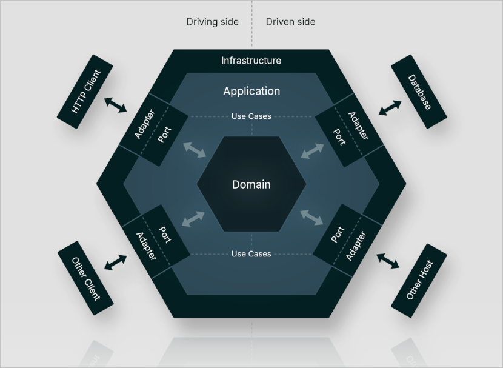
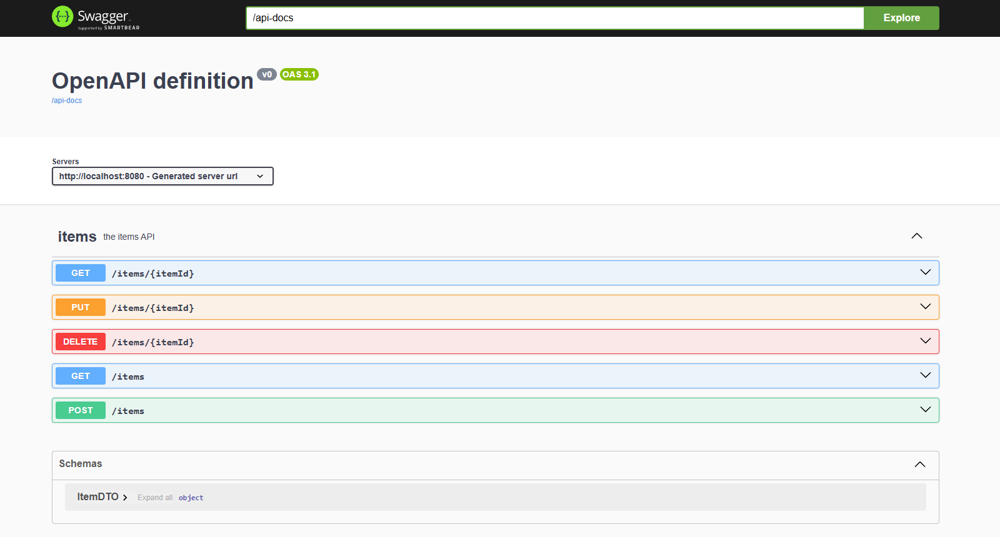
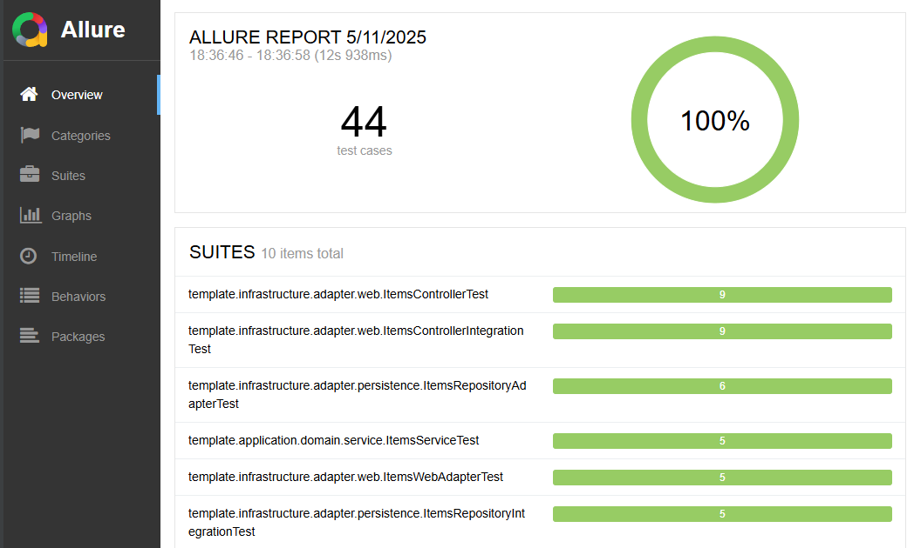

> This documentation is also available in an enhanced form at
> [Hexagonal Architecture Template](https://kamilmazurek.pl/hexagonal-architecture-template) page.

# Hexagonal Architecture Template
This repository contains an implementation of Java-based microservice,
that follows the principles of Hexagonal Architecture (also known as Ports and Adapters),
and can be used as a template.

The microservice is built with Spring Boot and offers a REST API with a clean,
modular structure that helps to quickly bootstrap scalable and testable services.
Key advantages:
* **Developer Productivity**: Ready-to-use structure speeds up the setup of new projects, ensuring consistent code organization.
* **Separation of Concerns**: Business logic is isolated from infrastructure code.
* **Scalability**: The architecture supports growing systems by making it easier to manage and extend code.
* **Flexibility**: Swapping out adapters (like different databases or communication protocols) requires minimal changes to the core logic.
* **Ease of Testing**: Decoupled components allow for straightforward unit and integration testing.

The goal was to keep it simple, clean and easy to modify.

## Quickstart

Following steps provide a quick way to get started with the template:

1. Ensure a JDK is available to build and run the code. Temurin, based on OpenJDK and available from [adoptium.net](https://adoptium.net/), can be used for this purpose.
2. Download the source code either by cloning the repository with Git or by downloading the ZIP file. If you downloaded the ZIP, extract it. Then navigate to the hexagonal-architecture-template folder.
3. Start the application using the development profile to load predefined data:
    ```shell
    mvnw spring-boot:run -Pdev
    ```
4. Verify that the application is running by sending a GET request to the following URL (you can simply open it in a browser):
    ```console
    http://localhost:8080/items/1
    ```
   The following item should be returned in the response:
    ```json
    [
      {
        "id": 1,
        "name":"Item A"
      }
    ]
    ```
5. Modify the source code to suit your needs, rebuild the project, and run the application 🚀.

## Table of contents
* [Motivation](#concept)
* [Concept](#concept)
* [Stack](#stack)
* [Build and deployment](#build-and-deployment)
* [REST API](#rest-api)
* [Swagger and OpenAPI endpoints](#swagger-and-openapi-endpoints)
* [Production-ready features](#production-ready-features)
* [Tests](#tests)
* [Additional resources](#additional-resources)
* [Author](#author)
* [Disclaimer](#disclaimer)

## Motivation

My main motivation for creating this project is to have an implementation of microservice
with hexagonal architecture, which can be used as a template, so I can reduce the overhead of the
repetitive task of creating new skeleton when I want to build something new,
while creating flexible Maven Archetype seemed to me too expensive compared to the benefits.

## Concept

The hexagonal architecture, also known as the ports and adapters architecture, was invented by Alistair Cockburn.
It is an architectural pattern that helps to avoid dependency-related problems in software design,
mainly by using loosely coupled components, that can be implemented, tested and deployed separately,
and then connected via ports and adapters.

It typically consists of Ports, Adapters, Application and Domain. Some sources also contain
information about Infrastructure, Use Cases and Driving/Driven side, which in my opinion
support interfaces segregation and fit the concept, so I decided to go with those as well.

Image below shows concept implemented in this repository:


<p align="center">
<i>concept diagram</i>
</p>
<p>
According to some sources hexagonal architecture is at the origin of the microservices architecture.
It makes me think of Spring Boot, which is commonly used to build microservices.
Spring Boot also supports many ways to integrate with other components (such as by HTTP, JDBC, JMS or with Kafka etc.)
and seems to me a natural choice to work with such an architecture pattern.
</p>

In result, this repository contains a template implementation of microservice with hexagonal architecture,
written in Java with Spring Boot. It is consisted of:
* Infrastructure
  * Adapters
    * HTTP (via controllers)
    * Persistence (via repository)
  * Swagger
  * OpenAPI
  * Spring Boot Actuator
* Application
  * Ports
  * Use Cases
  * Domain
* In-memory database H2

Please note that (as it is just a template) it supports handling HTTP requests and communication with database, however, depending on the needs,
it is open for further extensions (e.g. Other Client and Other Host presented in the image above).

## Stack

Application is implemented in Java with Spring Boot, and integrates with in-memory database (H2).
H2 seems to me a good choice for creating prototypes - however, it is easy to change the integration
with H2 to another database if needed, since the project uses Spring Data.
API is specified with OpenAPI, which is used to generate the interfaces and data model.
Additionally, OpenAPI simplifies creating clients for such microservice.
Project is covered by both unit and integration tests, and comes with Maven Surefire Plugin
and Maven Failsafe Plugin configured.

In summary, the stack looks as follows:
* Java 21
* Spring Boot
* OpenAPI
* H2 database
* ModelMapper
* JUnit
* REST Assured
* Mockito
* Apache Maven
* Allure Report
* Docker

## Build and deployment

Project can be built with Apache Maven. Standard build compiles project, executes both unit and integration tests,
and installs jar file in local repository:
```shell
mvnw clean install
```

Application can be deployed locally with following command:
```shell
mvnw spring-boot:run
```

or by running previously built jar:
```shell
mvnw clean package
java -jar target/hexagonal-architecture-template-1.0.0-SNAPSHOT.jar
```

The project comes with Dockerfile. To build Docker image and run it following commands can be used:
```shell
mvnw clean package
docker build -t template/hexagonal-architecture-template .
docker run -p 8080:8080 template/hexagonal-architecture-template
```

It also comes with profile for development purposes, that can be used to start application with some predefined data.
To start application with such profile following command can be used:
```shell
mvnw spring-boot:run -Pdev
```

## REST API

> **Important:** Operations described below, such as GET, POST, PUT and DELETE, can be performed using Swagger, accessible via http://localhost:8080/swagger-ui/index.html.

API is described in [api.yaml](src/main/resources/api.yaml) and is very simple (as it is just a template). It supports POST, GET, PUT and DELETE HTTP methods,
and thus allows to create, read, update and delete items. It essentially provides CRUD functionality:
* `POST /items` creates an item
* `GET /items` reads items 
* `GET /items/{itemId}` reads an item 
* `PUT /items/{itemId}` creates or updates an item
* `DELETE /items/{itemId}` deletes an item

By default, application runs on port 8080.
After successful deployment items can be retrieved by sending GET request to the following URL:
```console
http://localhost:8080/items
```

Response should contain items from the database. If there are no items, then empty array should be returned:
```json
[]
```

Items can be added to the database by the POST method, e.g. "Item A" can be added by using the following curl command on Linux:
```console
curl -i -X POST http://localhost:8080/items \
  -H "Content-Type: application/json" \
  -d '{"name":"Item A"}'
```

Items can be also added or updated by the PUT method, e.g. item with id 1 can be added or updated by using the following curl command on Linux:
```console
curl -i -X PUT http://localhost:8080/items/1 \
  -H "Content-Type: application/json" \
  -d '{"id":1, "name":"Item A"}'
```

Once the item has been successfully added, it should be returned in response to a GET http://localhost:8080/items request:
```json
[
  {
    "id": 1,
    "name":"Item A"
  }
]
```  

Item can also be retrieved by ID using items/{ID} path, e.g. by sending GET http://localhost:8080/items/1 request:
```json
{
  "id": 1,
  "name":"Item A"
}
```

Additionally, if application has been started with dev profile,
some test data should be automatically added to the database, and thus following items
should be returned in default response to a GET http://localhost:8080/items request:
```json
[
  {
    "id":1,
    "name":"Item A"
  },
  {
    "id":2,
    "name":"Item B"
  },
  {
    "id":3,
    "name":"Item C"
  }
]

```

Items can be removed by using DELETE method, e.g. item with id 1 can be removed by using the following curl command on Linux:
```console
curl -i -X DELETE http://localhost:8080/items/1
```

Alternatively, such operations (GET, POST, PUT, DELETE) can be performed using Swagger, accessible via http://localhost:8080/swagger-ui/index.html.

## Swagger and OpenAPI endpoints

Application comes with Swagger and OpenAPI /api-docs endpoint configured, accessible at the following URLs:
* http://localhost:8080/swagger-ui/index.html
* http://localhost:8080/api-docs

Swagger simplifies performing HTTP request, and thus may be useful for testing, or just manually using application:


<p align="center">
<i>Sample Swagger view. For more information about Swagger please visit</i>
<a href="https://swagger.io"><i>https://swagger.io</i></a>
</p>

OpenAPI /api-docs endpoint can be useful to share API documentation in json format.

## Production-ready features

Application comes with Spring Boot Actuator configured, and thus allows to use some production-ready features:
* `/actuator` endpoint: http://localhost:8080/actuator/
* `/actuator/health` endpoint: http://localhost:8080/actuator/health

List of available actuator-related endpoints can be found using `/actuator` endpoint.
This list can be changed by modifying `management.endpoints.web.exposure.include` property in [application.yaml](src/main/resources/application.yaml).
For example, if there is a need for `beans` endpoint, then it can be enabled by adding `beans` to `management.endpoints.web.exposure.include` list,
for example like this:
```yaml
management:
  endpoints:
    web:
      exposure:
        include: health, beans
```

More information can be found here: https://docs.spring.io/spring-boot/reference/actuator/endpoints.html

Application health can be checked by using `/actuator/health` endpoint. In response information about running application should be returned:
```json
{
  "status": "UP"
}
```

It is possible to configure application to return more detailed information, e.g. about disk usage or database.
I decided to not enable it by default for security reasons.
However, it can be achieved by adding following entry to [application.yaml](src/main/resources/application.yaml):
```yaml
management:
  endpoint:
    health:
      show-details: "always"
```

After applying such change, additional information can be obtained from `/actuator/health` endpoint. It also creates new endpoints,
e.g. `/actuator/health/db` providing information about database:
```json
{
  "status": "UP",
  "details": {
    "database": "H2",
    "validationQuery": "isValid()"
  }
}
```

## Tests

Project is covered by both unit and integration tests, and comes with Maven Surefire Plugin
and Maven Failsafe Plugin configured.

Tests are written using JUnit, REST Assured and Mockito. There are 2 types of tests implemented in this project:
* Unit tests (suffixed with Test), that are run with the Maven Surefire Plugin
* Integration tests (suffixed with IntegrationTest), that are run with the Maven Failsafe Plugin

Unit tests can be run with the Maven Surefire Plugin using following command:
```console
mvnw clean test
```

Integration tests can be run with the Maven Failsafe Plugin using following command:
```console
mvnw clean integration-test
```
Please note that this also runs unit tests.

Both test types are also run when standard build is performed:
```console
mvnw clean install
```

Additionally, project comes with Allure Report configured, so it is possible to see test reports via browser.
It can be achieved by running following commands:
```console
mvnw clean integration-test
mvnw allure:serve
```
In result test report should be displayed in the browser. An excerpt from such a view is presented below:


<p align="center">
<i>Sample Allure Report. For more information about Allure Report please visit</i>
<a href="https://allurereport.org/"><i>https://allurereport.org/</i></a>
</p>

## Additional resources
* [Hexagonal Architecture, Alistair Cockburn website](https://alistair.cockburn.us/hexagonal-architecture)
* [Hexagonal Architecture, Wikipedia](https://en.wikipedia.org/wiki/Hexagonal_architecture_(software))
* [Hexagonal Architecture, Medium](https://medium.com/idealo-tech-blog/hexagonal-ports-adapters-architecture-e3617bcf00a0)
* [Domain-Driven Hexagon](https://github.com/Sairyss/domain-driven-hexagon)
* [Hexagonal Architecture Template on LibHunt](https://www.libhunt.com/r/hexagonal-architecture-template)

## Author

Created by [Kamil Mazurek](https://kamilmazurek.pl), a Software Engineer based in Warsaw, Poland.

## Disclaimer

THIS SOFTWARE IS FOR EDUCATIONAL PURPOSES ONLY. THE SOFTWARE IS PROVIDED "AS IS", WITHOUT WARRANTY OF ANY KIND.
THE AUTHOUR SHALL NOT BE LIABLE FOR ANY DAMAGES, CLAIM OR OTHER LIABILITY ARISING FROM THE USE OF THE SOFTWARE
OR OTHER DEALINGS IN THE SOFTWARE.

Spring Boot is a trademark of Broadcom Inc. and/or its subsidiaries.
Oracle, Java, MySQL, and NetSuite are registered trademarks of Oracle and/or its affiliates. Other names may be trademarks of their respective owners.