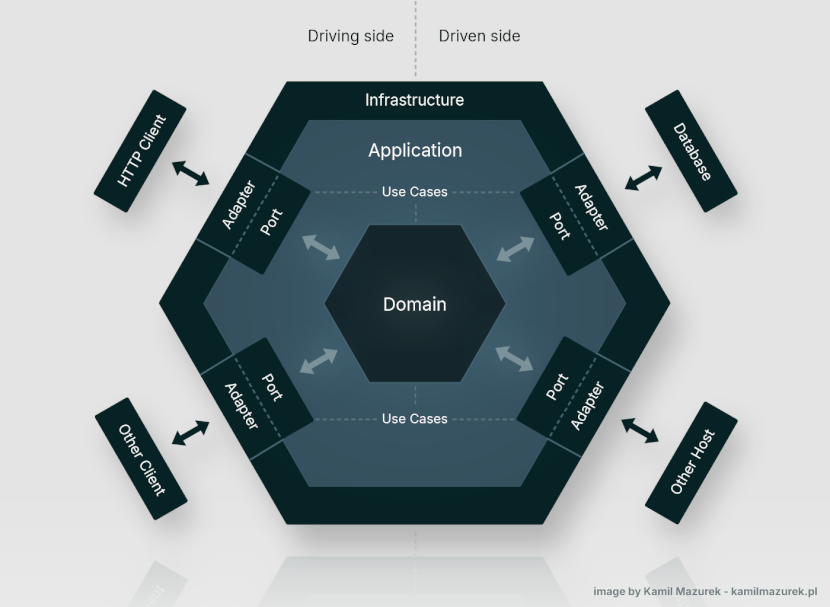
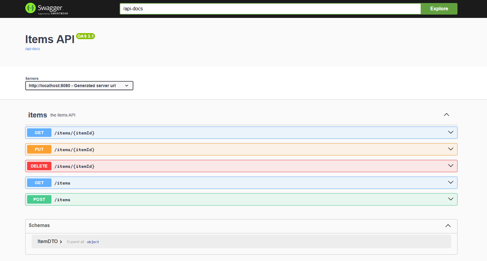
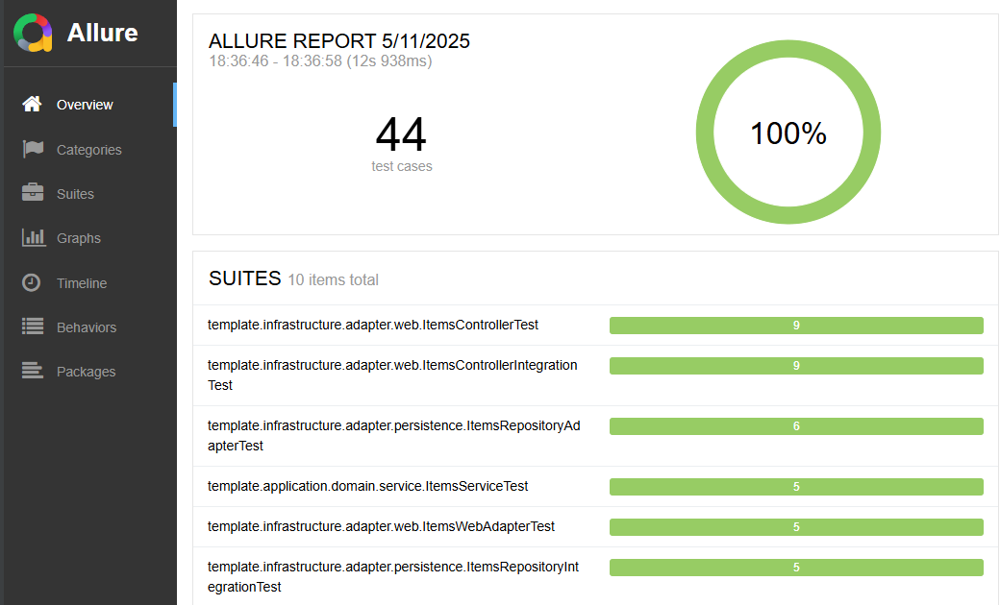

> This documentation is also available in an enhanced form at
> [Hexagonal Architecture Template](https://kamilmazurek.pl/hexagonal-architecture-template) page.

# Hexagonal Architecture Template
This repository contains an implementation of Java-based microservice,
that follows the principles of Hexagonal Architecture (also known as Ports and Adapters),
and can be used as a template.

The microservice is built with Spring Boot and offers a REST API with a clean,
modular structure that helps to quickly bootstrap scalable and testable services.
Key advantages:
* **Developer Productivity**: Ready-to-use structure speeds up the setup of new projects, ensuring consistent code organization.
* **Separation of Concerns**: Business logic is isolated from infrastructure code.
* **Scalability**: The architecture supports growing systems by making it easier to manage and extend code.
* **Flexibility**: Swapping out adapters that integrate different databases or communication protocols requires minimal changes to the core logic.
* **Ease of Testing**: Decoupled components allow for straightforward unit and integration testing.

The goal is to keep it simple, clean and easy to modify.

## Quickstart

Following steps provide a quick way to get started with the template:

1. Ensure a JDK is available to build and run the code. Temurin, based on OpenJDK and available from [adoptium.net](https://adoptium.net/), can be used for this purpose.
2. Download the source code either by cloning the repository with Git or by downloading the ZIP file. If you downloaded the ZIP, extract it. Then navigate to the hexagonal-architecture-template folder.
3. Start the application using the development profile to load predefined data:
    ```shell
    mvnw spring-boot:run -Pdev
    ```
4. Verify that the application is running by sending a GET request to the following URL (you can simply open it in a browser):
    ```console
    http://localhost:8080/items/1
    ```
   The following item should be returned in the response:
    ```json
    [
      {
        "id": 1,
        "name":"Item A"
      }
    ]
    ```
5. Modify the source code to suit your needs, rebuild the project, and run the application 🚀.

## Table of contents
* [Motivation](#motivation)
* [Concept](#concept)
* [When to Use Hexagonal Architecture](#when-to-use-hexagonal-architecture)
* [Stack](#stack)
* [How It Works](#how-it-works) 
* [Build and Deployment](#build-and-deployment)
* [REST API](#rest-api)
* [Swagger and OpenAPI Endpoints](#swagger-and-openapi-endpoints)
* [Production-Ready Features](#production-ready-features)
* [Tests](#tests)
* [Additional resources](#additional-resources)
* [Author](#author)
* [Disclaimer](#disclaimer)

## Motivation

My main motivation for creating this project was to have an implementation of a microservice with Hexagonal Architecture that can be reused as a template.
This reduces the overhead of repeatedly creating a project skeleton whenever I want to build a new project.
I considered building a flexible Maven Archetype, but it seemed too costly compared to the benefits.

## Concept

The Hexagonal Architecture, also known as the ports and adapters architecture, was invented by Alistair Cockburn.
It is an architectural pattern designed to avoid dependency-related problems in software design,
primarily by using loosely coupled components that can be implemented, tested, and deployed separately, then connected via ports and adapters.

It typically consists of Ports, Adapters, Application, and Domain.
Some sources also mention Infrastructure, Use Cases, and the Driving/Driven side, which, in my opinion, support interface segregation and align well with the concept, so I decided to include them as well.

The image below shows the concept implemented in this project:


<p align="center">
<i>Hexagonal Architecture Template concept diagram</i>
</p>

According to some sources, Hexagonal Architecture is at the origin of microservices architecture.
It makes me think of Spring Boot, which is commonly used to build microservices.
Spring Boot also supports many ways to integrate with other components (such as HTTP, JDBC, JMS, or Kafka) and seems to me a natural choice to work with such an architecture pattern.

As a result, this project contains a template implementation of a microservice with Hexagonal Architecture, written in Java with Spring Boot.
The implementation is designed to be modular, flexible, and easy to extend. It consists of:
* Infrastructure
    * Adapters
        * HTTP (via controllers)
        * Persistence (via repository)
    * Swagger
    * OpenAPI
    * Spring Boot Actuator
* Application
    * Ports
    * Use Cases
    * Domain
    * Exception
* In-memory database H2

Please note that, as this is just a template, it supports handling HTTP requests and communication with the database.
However, depending on your needs, it is open to further extensions (e.g., Other Client and Other Host as shown in the image above).
By following the principles of Hexagonal Architecture, the project ensures a clear separation of concerns and easier maintainability.
The provided structure is adaptable, allowing you to extend or customize components as your application evolves.

## When to Use Hexagonal Architecture

Hexagonal Architecture (also known as Ports and Adapters) helps separate your core business logic from external concerns like databases and user interfaces.
This separation improves modularity and testability, making it easier to adapt your application as requirements evolve.

This architecture is particularly beneficial for projects with complex business rules or systems expected to expand and adapt.
If you need to keep your core logic independent from external technologies, or want to support multiple ways of interacting with your application (such as REST APIs, messaging, or batch processing),
Hexagonal Architecture offers a flexible and extensible foundation that makes adjusting to new requirements simpler.
Its clear separation of concerns also helps teams work more independently and speeds up development.

However, for small or simple applications, or projects with very tight deadlines, the added structure of Hexagonal Architecture might be unnecessary overhead.
In such cases, a simpler, more straightforward architecture could be easier to implement and maintain without compromising too much on quality.
If that sounds like a better fit, you might be interested in the [Layered Architecture Template](https://kamilmazurek.pl/layered-architecture-template).

Ultimately, choosing Hexagonal Architecture depends on your project's complexity and long-term goals.
When done right, it can make your application more resilient, easier to test, and simpler to evolve as needs change.
It’s an excellent choice for applications that are designed to scale and adapt over time.

## Stack

The application is implemented in Java with Spring Boot, and integrates with an in-memory database (H2).
H2 seems like a good choice for creating prototypes - however, it's easy to switch to another database if needed, since the project uses Spring Data.
The API is specified using OpenAPI, which is used to generate both the interfaces and the data model.
Additionally, OpenAPI simplifies the process of creating clients for this kind of microservice.
The project is covered by both unit and integration tests, and comes with the Maven Surefire Plugin and Maven Failsafe Plugin preconfigured.

In summary, the stack looks as follows:
- **Language & Framework**
    - **Java 21** – Main programming language used to implement the application
    - **Spring Boot** – Framework for building standalone, production-grade Spring applications

- **API & Data**
    - **OpenAPI** – Specification for describing and documenting RESTful APIs
    - **ModelMapper** – Library for mapping data between objects, such as DTOs, domain models, and entities
    - **H2 Database** – Lightweight in-memory database used for development and testing

- **Testing**
    - **JUnit** – Framework for writing unit tests in Java
    - **REST Assured** – Library for testing REST APIs in a fluent and readable way
    - **Mockito** – Mocking framework for unit testing Java components
    - **Allure Report** – Tool for generating clear and detailed test execution reports

- **Build & Deployment**
    - **Apache Maven** – Build automation tool used for managing dependencies and running tests
    - **Docker** – Platform for packaging applications into containers for consistent deployment

This technology stack provides a solid foundation for building and maintaining scalable, maintainable microservices with Hexagonal Architecture.
Each component was chosen to balance simplicity, flexibility, and robust functionality.

## How It Works

This implementation follows Hexagonal Architecture principles by clearly separating different parts of the application to maintain clean boundaries and improve flexibility.
To explain how these parts work together, let's walk through the Read use case, triggered by a GET request.
We begin at the controller and follow the request through the adapter, into the port and domain service, down to the database, and finally back to the controller to form the API response.

The API is defined using OpenAPI, which automatically generates the necessary classes during the build process.
These classes are then used by ItemsController to handle incoming requests.
```java
@RestController
@AllArgsConstructor
public class ItemsController implements ItemsApi {

    private final ItemsWebAdapter adapter;

    @Override
    public ResponseEntity<ItemDTO> getItem(Long id) {
        return adapter.getItem(id).map(ResponseEntity::ok).orElse(ResponseEntity.notFound().build());
    }

    @Override
    public ResponseEntity<List<ItemDTO>> getItems() {
        return ResponseEntity.ok(adapter.getItems());
    }

    (...)

}
```

Then the request is processed by ItemsWebAdapter, which maps between the API model and the domain model, and passes data to the domain through a port.
This approach helps keep the domain isolated from infrastructure concerns and makes the system easier to test and maintain.
```java
@Component
@AllArgsConstructor
public class ItemsWebAdapter {

    private final ItemsWebPort port;

    private final ModelMapper mapper;

    public Optional<ItemDTO> getItem(Long id) {
        return port.read(id).map(this::toDTO);
    }

    public List<ItemDTO> getItems() {
        return port.read().stream().map(this::toDTO).toList();
    }

    (...)

    @VisibleForTesting
    ItemDTO toDTO(Item item) {
        return mapper.map(item, ItemDTO.class);
    }

    @VisibleForTesting
    Item toDomainObject(ItemDTO itemDTO) {
        return mapper.map(itemDTO, Item.class);
    }

}
```

Ports handle specific use cases and implement well-defined interfaces to ensure clear contracts and easy interchangeability.
As a template, this implementation includes interfaces for basic use cases such as Create, Read, Upsert (update or insert), and Delete, for example:
```java
public interface Read {

    Optional<Item> read(Long id);

    List<Item> read();

}
```

Therefore, the ItemsWebPort interface extends the Create, Read, Upsert, and Delete interfaces, as follows:
```java
public interface ItemsWebPort extends Create, Read, Upsert, Delete {

}
```

The ItemsService class implements ItemsWebPort and delegates calls to the underlying ItemsRepositoryPort, acting as a bridge between domain logic and data access.
This is also where more complex business rules and domain logic can be added as needed.
```java
@Service
@AllArgsConstructor
public class ItemsService implements ItemsWebPort {

    private final ItemsRepositoryPort port;

    @Override
    public Optional<Item> read(Long id) {
        return port.read(id);
    }

    @Override
    public List<Item> read() {
        return port.read();
    }

    (...)

}
```

Processing continues via ItemsRepositoryPort, an interface extending the basic use cases (Create, Read, Upsert, Delete) and looks like this:
```java
public interface ItemsRepositoryPort extends Create, Read, Upsert, Delete {

}
```

ItemsRepositoryPort is implemented by ItemsRepositoryAdapter, which handles mapping between the domain model and database entities.
It interacts with ItemsRepository to fetch data from the database and converts it into domain objects.
```java
@Component
@AllArgsConstructor
public class ItemsRepositoryAdapter implements ItemsRepositoryPort {

    private final ItemsRepository repository;

    private final ModelMapper mapper;

    @Override
    public Optional<Item> read(Long id) {
        return repository.findById(id).map(this::toDomainObject);
    }

    @Override
    public List<Item> read() {
        return repository.findAll().stream().map(this::toDomainObject).toList();
    }
  
    (...)

}
```

The ItemsRepository implementation is very simple and uses Spring Data JpaRepository to handle database operations:
```java
@Repository
public interface ItemsRepository extends JpaRepository<ItemEntity, Long> {

    @Query("select max(item.id) from ItemEntity item")
    Long findMaxID();

}
```
When data is retrieved from the database, it is transferred back through the adapters and domain service, up to the API, and finally returned in the HTTP response.

By following these principles, the application remains adaptable to change, allowing new features or integrations to be added with minimal impact on existing code.
This approach supports long-term maintainability and clean code organization.

## Build and Deployment

The project is built with Apache Maven.
The standard build compiles the project, executes both unit and integration tests, and installs the JAR file into the local repository:
```shell
mvnw clean install
```

You can deploy the application locally using the following command:
```shell
mvnw spring-boot:run
```

Alternatively, build the application and run the generated JAR file with:
```shell
mvnw clean package
java -jar target/hexagonal-architecture-template-1.0.0-SNAPSHOT.jar
```

The project includes a Dockerfile. To build the Docker image and run the container, use the following commands:
```shell
mvnw clean package
docker build -t template/hexagonal-architecture-template .
docker run -p 8080:8080 template/hexagonal-architecture-template
```

There is also a development profile available that starts the application with predefined data. To launch it, run:
```shell
mvnw spring-boot:run -Pdev
```

With these build and deployment options, the project offers a flexible foundation for building, testing, and deploying the application locally or in containerized environments.
The setup can be extended and adapted to meet evolving requirements.

## REST API

> **Important:**  Operations such as GET, POST, PUT, and DELETE can be performed using Swagger, accessible at http://localhost:8080/swagger-ui/index.html.

The API is defined in [api.yaml](src/main/resources/api.yaml) and kept simple, as this is just a template.
It supports POST, GET, PUT, and DELETE HTTP methods, enabling create, read, update (or upsert, more precisely), and delete operations.
While it provides basic CRUD functionality, it is designed to be open for further extension.
* `POST /items` - Creates a new item
* `GET /items` - Retrieves all items
* `GET /items/{itemId}` - Retrieves a specific item by ID
* `PUT /items/{itemId}`  - Creates or updates an item by ID
* `DELETE /items/{itemId}` - Deletes an item by ID

By default, the application runs on port 8080.
After successful deployment, items can be retrieved by sending a GET request to the following URL:
```console
http://localhost:8080/items
```

The response should include items from the database. If no items are found, an empty array is returned:
```json
[]
```

Items can be added to the database using the <strong>POST method</strong>. For example, "Item A" can be added with the following curl command on Linux:
```console
curl -i -X POST http://localhost:8080/items \
  -H "Content-Type: application/json" \
  -d '{"name":"Item A"}'
```

Items can also be added or updated with the PUT method. For example, item with ID 1 can be added or updated using this curl command on Linux:
```console
curl -i -X PUT http://localhost:8080/items/1 \
  -H "Content-Type: application/json" \
  -d '{"id":1, "name":"Item A"}'
```

Once an item is successfully added, it will be returned in response to a GET http://localhost:8080/items request:
```console
http://localhost:8080/items
```
```json
[
  {
    "id": 1,
    "name":"Item A"
  }
]
```  

An item can also be retrieved by ID using the items/{ID} path, e.g., by sending a GET http://localhost:8080/items/1 request:
```console
http://localhost:8080/items/1
```
```json
{
  "id": 1,
  "name":"Item A"
}
```

Additionally, if the application has been started with the dev profile, some test data should be automatically added to the database.
As a result, the following items should be returned in the default response to a GET http://localhost:8080/items request:
```console
http://localhost:8080/items
```
```json
[
  {
    "id":1,
    "name":"Item A"
  },
  {
    "id":2,
    "name":"Item B"
  },
  {
    "id":3,
    "name":"Item C"
  }
]
```

Items can be removed using the DELETE method. For example, to delete the item with ID 1, use the following curl command on Linux:
```console
curl -i -X DELETE http://localhost:8080/items/1
```

Alternatively, these operations (GET, POST, PUT, DELETE) can be performed via Swagger, accessible at  http://localhost:8080/swagger-ui/index.html.

This API follows the principles of Hexagonal Architecture, providing a clean and modular foundation that makes it easy to extend and adapt as your application grows.

## Swagger and OpenAPI Endpoints

The application includes Swagger and a configured OpenAPI /api-docs endpoint, accessible at the following URLs:
* http://localhost:8080/swagger-ui/index.html
* http://localhost:8080/api-docs

Swagger simplifies making HTTP requests by providing an interactive interface to easily test and explore API endpoints.
This makes it especially useful for testing or manually interacting with the application without needing extra tools or clients:


<p align="center">
<i>Sample Swagger view. For more information about Swagger please visit</i>
<a href="https://swagger.io"><i>https://swagger.io</i></a>
</p>

The OpenAPI /api-docs endpoint serves the API documentation in JSON format.
This standardized documentation can be used to easily share the API details with other developers, generate client code, or integrate with various tools that support OpenAPI specifications.
It’s a convenient way to keep your API contract clear and up-to-date.

These tools simplify API testing and interaction while keeping documentation current and accessible.
This enhances collaboration, accelerates development, and helps team members stay aligned on the API's design and functionality.

## Production-Ready Features

The application comes with Spring Boot Actuator configured, providing access to several production-ready features:
* `/actuator` endpoint: http://localhost:8080/actuator/
* `/actuator/health` endpoint: http://localhost:8080/actuator/health

A list of available actuator-related endpoints can be easily accessed via the `/actuator` endpoint URL.
This list can be customized by modifying the `management.endpoints.web.exposure.include` property in [application.yaml](src/main/resources/application.yaml).
For example, to enable the beans actuator endpoint, simply add `beans` to the  `management.endpoints.web.exposure.include` list, for instance:
```yaml
management:
  endpoints:
    web:
      exposure:
        include: health, beans
```

Details on Actuator endpoints and configuration are available here: https://docs.spring.io/spring-boot/reference/actuator/endpoints.html

Application health can be checked via the `/actuator/health` endpoint. The response will provide status information about the running application:
```console
http://localhost:8080/actuator/health
```
```json
{
  "status": "UP"
}
```

The application can be configured to return more detailed health information, such as disk usage or database status.
For security reasons, this is not enabled by default. To enable it, add the following entry to[application.yaml](src/main/resources/application.yaml):
```yaml
management:
  endpoint:
    health:
      show-details: "always"
```

After applying this change, additional detailed information can be retrieved from the `/actuator/health` endpoint.
It also enables new endpoints, such as `/actuator/health/db`, which provide information about the database:
```console
http://localhost:8080/actuator/health/db
```
```json
{
  "status": "UP",
  "details": {
    "database": "H2",
    "validationQuery": "isValid()"
  }
}
```

This set of production-ready features provides valuable insights and control over your application’s health and behavior.
Properly configuring and securing these endpoints ensures you can monitor your app effectively while maintaining a strong security posture.

**Important:** In production environments, actuator endpoints should be secured to prevent unauthorized access.
It is recommended to limit access through authentication and authorization. Exercise caution when enabling detailed health data or other sensitive information.

## Tests

The project is covered by both unit and integration tests, with the Maven Surefire Plugin and Maven Failsafe Plugin pre-configured to run them.
Tests are written using JUnit, Mockito, and REST Assured, covering both business logic and API layers. There are two types of tests:
* Unit tests (*Test.java) are run by Surefire and focus on individual components like services or adapters.
* Integration tests (*IntegrationTest.java) are run by Failsafe and verify how application components work together.

Unit tests can be run using the Maven Surefire Plugin with the following command:
```console
mvnw clean test
```

Integration tests can be run with the Maven Failsafe Plugin using the following command:
```console
mvnw clean integration-test
```
Please note that this also runs unit tests.

Both test types are also run when standard build is performed:
```console
mvnw clean install
```

Additionally, the project comes with Allure Report configured, allowing you to view test reports in your browser.
You can generate and view the reports by running the following commands:
```console
mvnw clean integration-test
mvnw allure:serve
```
As a result, the test report should open in your browser. An excerpt from such a report is shown below:


<p align="center">
<i>Sample Allure Report. For more information about Allure Report please visit</i>
<a href="https://allurereport.org/"><i>https://allurereport.org/</i></a>
</p>

These tests include unit tests, which focus on domain logic and individual components, and integration tests, which ensure that the application works correctly as a whole, including the API and database.
This approach works well with the modular structure of Hexagonal Architecture.

## Additional resources
* [Hexagonal Architecture, Alistair Cockburn website](https://alistair.cockburn.us/hexagonal-architecture)
* [Hexagonal Architecture, Wikipedia](https://en.wikipedia.org/wiki/Hexagonal_architecture_(software))
* [Hexagonal Architecture, Medium](https://medium.com/idealo-tech-blog/hexagonal-ports-adapters-architecture-e3617bcf00a0)
* [Domain-Driven Hexagon](https://github.com/Sairyss/domain-driven-hexagon)
* [Hexagonal Architecture Template on LibHunt](https://www.libhunt.com/r/hexagonal-architecture-template)

## Author
This project was created by [Kamil Mazurek](https://kamilmazurek.pl), a Software Engineer based in Warsaw, Poland.
You can also find me on my [LinkedIn profile](https://www.linkedin.com/in/kamil-mazurek). Thanks for visiting 🙂

## Disclaimer

THIS SOFTWARE AND ANY ACCOMPANYING DOCUMENTATION (INCLUDING, BUT NOT LIMITED TO, THE README.MD FILE) ARE PROVIDED
FOR EDUCATIONAL PURPOSES ONLY.

THE SOFTWARE AND DOCUMENTATION ARE PROVIDED "AS IS", WITHOUT WARRANTY OF ANY KIND, EXPRESS OR IMPLIED,
INCLUDING BUT NOT LIMITED TO THE WARRANTIES OF MERCHANTABILITY, FITNESS FOR A PARTICULAR PURPOSE AND NONINFRINGEMENT.
IN NO EVENT SHALL THE AUTHORS OR COPYRIGHT HOLDERS BE LIABLE FOR ANY CLAIM, DAMAGES OR OTHER LIABILITY,
WHETHER IN AN ACTION OF CONTRACT, TORT OR OTHERWISE, ARISING FROM, OUT OF OR IN CONNECTION WITH THE SOFTWARE,
THE DOCUMENTATION, OR THE USE OR OTHER DEALINGS IN THE SOFTWARE OR DOCUMENTATION.

Spring Boot is a trademark of Broadcom Inc. and/or its subsidiaries.
Oracle, Java, MySQL, and NetSuite are registered trademarks of Oracle and/or its affiliates. Other names may be trademarks of their respective owners.