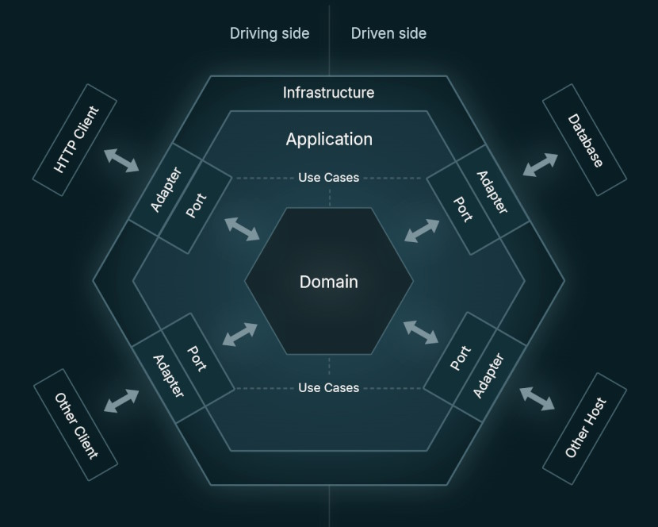

# Hexagonal architecture with Spring Boot

This repository contains an implementation of microservice with hexagonal architecture,
written in Java with Spring Boot.

My main motivation for creating this project is to have an implementation of microservice
with hexagonal architecture, which can be used as a template, so I can reduce the overhead of the
repetitive task of creating new skeleton when I want to build something new,
while creating Maven Archetype seemed not flexible enough for me.

The goal was to keep it simple, clean and easy to modify.

## Concept

The hexagonal architecture, also known as the ports and adapters architecture, was invented by Alistair Cockburn.
It is an architectural pattern that helps to avoid dependency-related problems in software design,
mainly by using loosely coupled components, that can be implemented, tested and deployed separately,
and then connected via ports and adapters.

It typically consists of Ports, Adapters, Application and Domain. Some sources also contain
information about Infrastructure, Use Cases and Driving/Driven side, which in my opinion
support interfaces segregation and fit the concept, so I decided to go with those as well.

Image below shows concept implemented in this repository:



Some sources say, that the hexagonal architecture is at the origin of the microservices architecture.
It makes me think of Spring Boot, which is commonly used to build microservices.
Spring Boot also supports many ways to integrate with other components (such as by HTTP, JDBC, JMS or with Kafka etc.)
and seems to me a natural choice to work with such an architecture pattern.

In result, this repository contains a template implementation of microservice with hexagonal architecture,
written in Java with Spring Boot. It is consisted of:
* Infrastructure package
  * Adapters (web and persistence)
* Application package
  * Ports
  * Use Case
  * Domain

Please note that (as it is just a template) it supports handling HTTP requests and communication with database, however, depending on the needs,
it is open for further extensions (e.g. Other Client and Other Host presented in the image below).

## Stack

Application is implemented in Java with Spring Boot, and integrates with in-memory database (H2).
H2 seems to me a good choice for creating prototypes - however, it is easy to change the integration
with H2 to another database if needed, since the project uses Spring Data.
API is specified with OpenAPI, which is used to generate the interfaces and data model.
Additionally, OpenAPI simplifies creating clients for such microservice.
Project is covered by both unit and integration tests, and comes with Maven Failsafe Plugin
and Maven Surefire Plugin configured.

In summary, the stack looks as follows:
* Java 21
* Spring Boot
* OpenAPI
* H2 database
* ModelMapper
* JUnit
* REST Assured
* Apache Maven
* Docker

## Build and deployment

Project can be built with Apache Maven. Standard build compiles project, executes both unit and integration tests,
and installs jar file in local repository:
```shell
mvnw clean install
```

Application can be deployed locally with following command:
```shell
mvnw spring-boot:run
```

or by running previously built jar:
```shell
mvnw clean package
java -jar target/hexagonal-architecture-template-1.0.0-SNAPSHOT.jar
```

The project comes with Dockerfile. To build Docker image and run it following commands can be used:
```shell
mvnw clean package
docker build -t template/hexagonal-architecture-template .
docker run -p 8080:8080 template/hexagonal-architecture-template
```

It also comes with profile for development purposes, that can be used to start application with some predefined data.
To start application with such profile following command can be used:
```shell
mvnw spring-boot:run -Pdev
```

## REST API

API is described in [api.yaml](src/main/resources/api.yaml) and is very simple (as it is just a template):
```yaml
openapi: 3.0.0
info:
  version: 1.0.0
  title: Items API
  description: Template of API using items as an example
tags:
  - name: itemsAPI
paths:
  /items:
    get:
      operationId: getItems
      description: Returns a list of items
      tags:
        - items
      responses:
        '200':
          description: Successful response
          content:
            application/json:
              schema:
                type: array
                items:
                  $ref: '#/components/schemas/ItemDTO'
components:
  schemas:
    ItemDTO:
      type: object
      required:
        - id
        - name
      properties:
        id:
          type: long
        name:
          type: string
```

By default, application runs on port 8080.
After successful deployment items can be retrieved by sending GET request to the following URL:
```console
http://localhost:8080/items
```

Response should contain items from the database. If there are no items, then empty array should be returned:
```json
[]
```

However, if application has been started with dev profile,
some test data should be automatically added to the database, and thus following items
should be returned in response:
```json
[
  {
    "id":1,
    "name":"Item A"
  },
  {
    "id":2,
    "name":"Item B"
  },
  {
    "id":3,
    "name":"Item C"
  }
]
```

## Disclaimer

This software is for educational purposes only.

THE SOFTWARE IS PROVIDED "AS IS", WITHOUT WARRANTY OF ANY KIND,
EXPRESS OR IMPLIED, INCLUDING BUT NOT LIMITED TO THE WARRANTIES OF
MERCHANTABILITY, FITNESS FOR A PARTICULAR PURPOSE AND NONINFRINGEMENT.
IN NO EVENT SHALL THE AUTHORS BE LIABLE FOR ANY CLAIM, DAMAGES OR
OTHER LIABILITY, WHETHER IN AN ACTION OF CONTRACT, TORT OR OTHERWISE,
ARISING FROM, OUT OF OR IN CONNECTION WITH THE SOFTWARE OR THE USE OR
OTHER DEALINGS IN THE SOFTWARE.